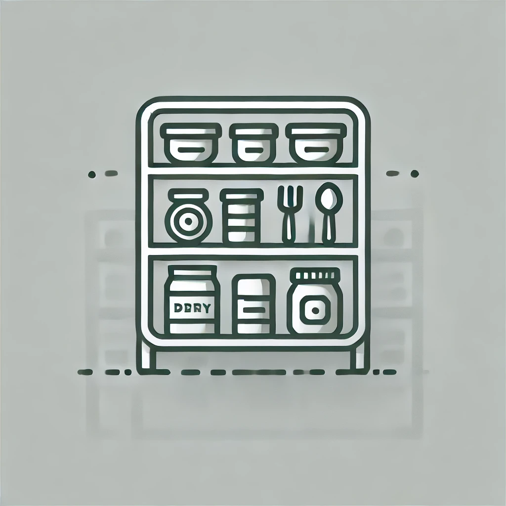

# <p align="center"> Pantry Tracker - HomeAssistant </p>

<p align="center">

</p>

# <p align="center"> NOTE THIS IS A WIP</p>


# Description
The Pantry Tracker add-on is a Home Assistant integration designed to help you keep track of products in your kitchen, pantry, or any other storage space. With a user-friendly interface and a powerful backend, this add-on simplifies the organization and management of your items by allowing you to create categories, assign products to them, and maintain an up-to-date inventory.

The add-on operates using a Flask API server hosted locally on port 5000 (restricted to the local network for security). All product and category data is stored persistently in a .db file using JSON, ensuring your data is retained across reboots.


# **Features**

🖥️ Responsive User Interface

The add-on provides a sleek, easy-to-navigate interface that adapts to different screen sizes for seamless use on both desktop and mobile devices.

📦 Product Management

Add, update, or remove products from your inventory.
Automatically track counts for individual products.

🗂️ Category Management

Create, edit, or delete custom categories.
Assign products to specific categories for better organization.

🔄 Real-Time Updates

Sensors in Home Assistant are updated in real time to reflect changes made via the API or the interface.

# Installation
1: Add [https://github.com/mintcreg/pantry_tracker/](https://github.com/mintcreg/pantry_tracker/) to repositories to the addon store

2: Install Addon from the addon store

3: Install [Pantry Tracker - Custom Components](https://github.com/mintcreg/pantry_tracker_components) (*Note; this needs to be installed after the pantry_tracker addon*)

4: Navigate to http://(HA-LOCAL-IP):5000 and add products/categories 

5: *(Optional) Install [Pantry Tracker Card](https://github.com/mintcreg/pantry_tracker_card)*


## Screenshots & Video

<details>
<summary>Products</summary>
 
<br>


</details>

<details>
<summary>Categories</summary>
 
<br>


</details>


<details>
<summary>Video</summary>
 
<br>


</details>


## API Endpoints

| **Endpoint**         | **Method** | **Description**                                                                                  | **Parameters (Body)**                                                                                   | **Response**                                                                                                                                                 |
|-----------------------|------------|--------------------------------------------------------------------------------------------------|---------------------------------------------------------------------------------------------------------|---------------------------------------------------------------------------------------------------------------------------------------------------------------|
| `/`                  | `GET`      | Root endpoint that serves the HTML UI.                                                          | None                                                                                                    | Renders `index.html`.                                                                                                                                        |
| `/categories`        | `GET`      | Fetch all categories.                                                                           | None                                                                                                    | `200`: List of category names. <br> Example: `["Fruits", "Vegetables"]` <br> `500`: Error message if fetch fails.                                           |
| `/categories`        | `POST`     | Add a new category.                                                                             | `{"name": "CategoryName"}`                                                                             | `200`: Updated list of categories. <br> `400`: Validation errors or duplicate category. <br> `500`: Error message if addition fails.                        |
| `/categories`        | `DELETE`   | Delete a category and reassign its products to "Uncategorized".                                 | `{"name": "CategoryName"}`                                                                             | `200`: Updated list of categories. <br> `400`: Validation errors. <br> `404`: Category not found. <br> `500`: Error message if deletion fails.              |
| `/products`          | `GET`      | Fetch all products along with their categories and URLs.                                        | None                                                                                                    | `200`: List of products with their details. <br> Example: `[{"name": "Apple", "url": "image.jpg", "category": "Fruits"}]` <br> `500`: Error message if fails. |
| `/products`          | `POST`     | Add a new product.                                                                              | `{"name": "ProductName", "url": "ProductImageURL", "category": "CategoryName"}`                         | `200`: Updated list of products. <br> `400`: Validation errors or duplicate product. <br> `500`: Error message if addition fails.                           |
| `/products`          | `DELETE`   | Delete a product by name.                                                                       | `{"name": "ProductName"}`                                                                              | `200`: Updated list of products. <br> `400`: Validation errors. <br> `404`: Product not found. <br> `500`: Error message if deletion fails.                 |
| `/update_count`      | `POST`     | Update the count of a specific product by entity ID.                                            | `{"entity_id": "sensor.product_name", "action": "increase/decrease", "amount": 1}`                      | `200`: Updated count. <br> Example: `{"status": "ok", "count": 5}` <br> `400`: Validation errors. <br> `404`: Product not found. <br> `500`: Error message. |
| `/counts`            | `GET`      | Fetch the current count of all products.                                                        | None                                                                                                    | `200`: Dictionary of product counts keyed by `entity_id`. <br> Example: `{"sensor.product_apple": 5}` <br> `500`: Error message if fetch fails.             |
| `/health`            | `GET`      | Health check endpoint to verify the service is running.                                         | None                                                                                                    | `200`: Health status. <br> Example: `{"status": "healthy"}`                                                                                                 |


# Roadmap
```bash
  > Full ability to manage existing products
  
  > Integrate with UPC/EAN Database

  > Provide functionality for barcode scanning to add/remove/increase/decrease quantities
``` 


